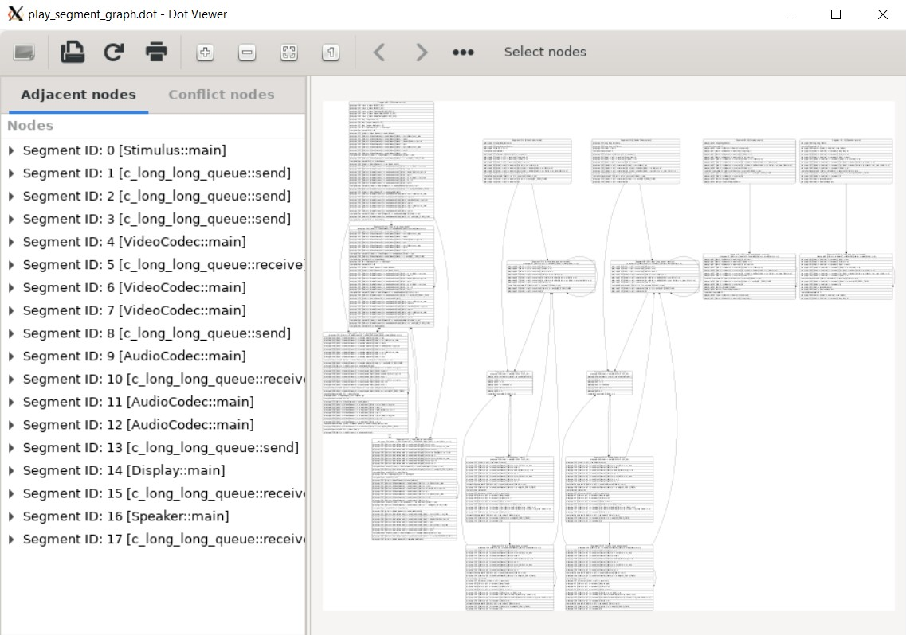

About _sysdot.py_
=================

This program is a modification of xdot, taken from [xdot.py](https://github.com/jrfonseca/xdot.py), meant to be working for RISC compiler under Professor Doemer of UCI.

Features
========

 * Keyboard/mouse navigation.
 * Supports events on the nodes with URLs.
 * Animated jumping between nodes.
 * Highlights node/edge under mouse.
 * Support for visualizing conflict graphs as well, by using a conflict graph file.
 * Visualizing sub-sections of graph, by marking nodes.

 

Requirements
============

 * [Python 3](https://www.python.org/download/)

 * [PyGObject bindings for GTK3](https://pygobject.readthedocs.io)

 * [Graphviz](http://www.graphviz.org/Download.php)

Command Line
------------

If you install _sysdot.py_ from PyPI or from your Linux distribution package managing system, you should have the `sysdot` somewhere in your `PATH` automatically.

When running _sysdot.py_ from its source tree, you can run it by first setting `PYTHONPATH` environment variable to the full path of _sysdot.py_'s source tree, then running:

    python3 -m sysdot

You can also pass the following options:

    Usage:
    	sysdot.py [file|-]
    
    Options:
      -h, --help            show this help message and exit
      -f FILTER, --filter=FILTER
                            graphviz filter: dot, neato, twopi, circo, or fdp
                            [default: dot]
      -g GEOMETRY           default window size in form WxH
    
    Shortcuts:
      Up, Down, Left, Right     scroll
      PageUp, +, =              zoom in
      PageDown, -               zoom out
      R                         reload dot file
      F                         find
      Q                         quit
      P                         print
      Escape                    halt animation
      Ctrl-drag                 zoom in/out
      Shift-drag                zooms an area

If `-` is given as input file then _sysdot.py_ will read the dot graph from the standard input.
